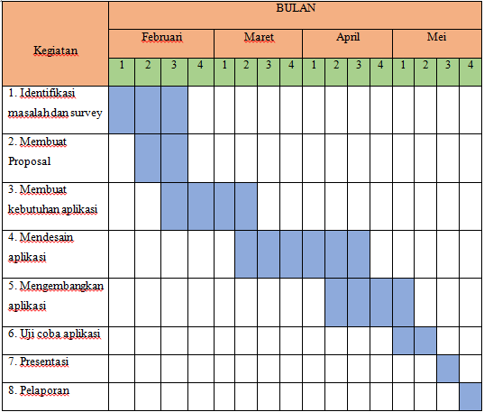

# Software Project Management Plan #

## Pendahuluan ##
1.1 Gambaran Proyek

M-Attendance Fingerprint (M-AFI) adalah sistem absensi menggunakan sidik jari (fingerprint) yang ditujukan untuk absensi guru dan siswa. M-AFI ini memiliki tiga user, yaitu user admin, guru, dan orang tua siswa, dimana user admin mengelola M-AFI menggunakan Website, dan user guru serta orang tua menggunakan App Android M-AFI yang berfungsi untuk memonitoring absensi. Dimana cara kerjanya yaitu guru dan siswa absen menggunakan sidik jari (fingerprint), kemudian user orang tua dan guru dapat melihat report absen nya melalui App Android M-AFI.

1.2 Dokumen-dokumen dalam proyek

- SPMP (Software Project Management Plan )
- SRS (Software Requirement Specifications).

1.3 Evolusi SPMP

Segala dokumen yang di buat dalam tahapan pembuatan projek ini dirawat oleh salah satu anggota yang diberikan tanggung jawab untuk sokumentasi, tetpi dalan pembuatannya dokumen ini dikerjakan secara bersama oleh tim.
Dokumen ini bersifat freeware, jadi siapa saja boleh untuk memanfaatkan dokumen ini untuk hal yang positif. Tentu ada hal-hal yang tidak boleh dilakukan dalam pemanfaatan dokumen ini, seperti menjualbelikan dokumen ini secara ilegal, atapun mengubah dokumen tanpa dasar yang jelas.

1.4 Material Acuan

Materi yang menjadi acuan dalam pembuatan projek ini menggunakan standar IEEE, karena menyediakan kerangka kerja yang menggabungkan seluruh spektrum proses siklus hidup perangkat lunak. Dan juga standar IEEE untuk membentuk model yang diakui secara internasional dari kehidupan perangkat lunak umum, siklus proses yang dapat direferensikan oleh industri perangkat lunak diseluruh dunia, untuk mempromosikan pemahaman diantara pihak bisnis dengan aplikasi umum serta mengakui proses, kegiatan dan tugas.

1.5 Definisi dan akronis (singkatan)

Dalam penulisan dokumen pembuatan projek ini, ada beberapa kata yang mungkin akan sulit dipahami oleh orang awam berikut ini :

- Firebase

Firebase Membantu Kita Membuat Aplikasi Realtime, Facebook notification, Whatsapp, Bbm, Disqus adalah contoh kecil aplikasi real-time yang sering kita pakai. Disaat user lain memberikan komen atau kirim pesan, pada saat itu juga kita mendapat notifikasi dan pesan. Secara general, jika ada input data, maka output pada saat itu langsung tampil di hadapan kita. "Kita" disini adalah orang yang mengoperasikan semua computer client yang terhubung dengan aplikasi tersebut. Bahkan bisa secara serentak. Walaupun ada delay, tidak akan lama waktunya (Low Latency).

Tabel I.1 Akronim

| Singkatan | Arti kata |
| --------- | --------- |
| M-AFI |	Mobile-Attendance Fingerprint |
| IEEE |	The International Institute ofElectronic and Electrical Engineers |
| SPMP |	Software Project Management Plan |

IEEE adalah standar yang mendefinisikan lapisan fisik dan sublapisan media akses kontrol dari lapisan data-link dari standar Ethernet berkabel.

M-AFI adalah nama project yang sedang kita garap.

SPMP adalah salah satu dokumentasi untuk merencanakan pembuatan project

## Organisasi Proyek ##

2.1 model proses

Untuk mengorganisasikan pekerjaan kami sehingga terarah, kami memilih model proses dengan cara Sashimi, dimana model proses seperti ini kami dapat meng-over lap proses yang sedang di kerjakan dengan satu langkah proses setelahnya.

2.2 struktur organisasi

2.3 Batasan dan antar muka organisasi

Project Manager : dimana harus mejadi pengawas dari anggota – anggotanya bilamana
saat anggota lalai dengan tugas – tugasnya, Project Manager berhak menegur dan bagi anggota tidak berhak melawan jika ditegur, dan untuk Project Manager sendiri tidak berhak semena-mena \dengan jabatanya.

Documentation : dimana harus memenuhi segala dokumentasi proyek dan selalu berkomunikasi dengan semua anggota termasuk Project Manager.

System Analysis : System analysis di harapkan mampu memecahkan dan mengembangkan permasalahan untuk menghasilkan solusi yang sesuai dengan tujuan dari apa yang dibutuhkan.

Desain UI/UX : hanya bertugas pada bagian front-end dari implementasi System Analysis.

Programmer : hanya bertugas pada bagian back-end dan selalu berkomunikasi dengan Desain UI/UX dan System Analysis.

2.4 lingkup tanggung jawab

Project Manager :

Project Manager adalah seseorang mempunyai tanggung jawab dan tugas yang besar dalam sebuah tim, tidak hanya terfokus pada hal-hal yang teknis sifatnya. Project Manager juga harus mampu memanagement tim dengan baik, agar target projek dapat tercapai. Selain itu memberi pengarahan, memonitoring kinerja tim, serta dapat membagi tugas dan bagian tanggung jawab dari seorang Project Manager.

Documentation :

Adalah seseorang yang bertanggung jawab terhadap pengaturan, pembuatan, dan rekam jejak segala jenis dokumen yang terlibat dalam proyek.
Mulai dari proposal dan kontrak proyek, sampai dengan hasil sampling atau
percobaan dalam proses pembangunan proyek.

System Analysis :

Banyak hal yang harus dilakukan oleh seorang System Analysis, terutama yang berkaitan dengan pemecahan masalah. Seorang System Analysis harus mampu menganalisa segala kemungkinan dari pemasalahan yang ada, dan dapat mengasilkan solusi yang tepat dari permasalahan tersebut. Menentukan sistem yang
tepat merupakan bagian dari tugas seorang sistem analis, sehingga kinerja tim dapat berjalasan secara efesien.

Design UI/UX :

Design UI/UX adalah dia yang membuat suatu tampilan untuk user yang mengimplementasikan perancangan sistem yang telah di buat oleh System Analysis.

Programmer :

Dalam hal ini, seorang programer bertugas untuk mengimplementasikan dari
sistem yang sudah dirancang dan didesain. Programmer dituntut dapat menuliskan code program dengan baik, dan efesien. Hal ini dimaksudakan untuk menghindari terjadinya banyak error dalam proses implementasinya.

## Proses Manajerial ##

3.1 Tujuan dan prioritas manajemen

Tujuan dari proyek ini adalah untuk mengembangkan sistem manajemen pada sekolah misalkan absensi. 
Proyek ini diprioritaskan untuk kebutuhan instansi.

3.2 Asumsi-asumsi, keterkaitan, dan batasan-batasan

1.Asumsi-asumsi dan keterkaitan

  Pada saat ini dimana teknologi sudah sangat pesat berkembang sistem presensi/kehadiran pada suatu instansi (dimana yang dimaksudkan instansi ini sekolah) masih hanya terfokus pada pihak guru dan karyawan saja, namun pada tingkat siswa-siswi/murid masih menggunakan metode manual menggunakan buku absensi yang sampai saat ini masih tetap bertahan di tengah perkembangan teknologi yang semakin tahun semakin dapat mempermudah kegitan/aktifitas manusia. dengan issu yang ada tersebut kami berencana untuk membuat suatu sistem presensi siswa-siswi/murid menggunakan fingerprint dan aplikasi mobile yang diperuntukkan untuk orang tua siswa untuk memonitoring kehadiran anaknya.
  - Aplikasi ini dapat berjalan dengan baik pada jaringan internet dan dapat diakses menggunanakan perangkat bergerak (mobile)

2.Batasan-batasan

  - Sistem presensi ini hanya diperuntukkan untuk siswa dan guru
  - Pengolahan/management data hanya dilakukan pada sisi admin melalui webserver
  - Aplikasi M-AFI hanya ditujukan untuk orang tua siswa dan guru

3.3 Manajemen resiko

 - Resiko teknologi misalnya kerusakan alat atau sistem
   
 - Resiko orang misalnya bentuk sidik jari yang rusak akibat kecelakaan atau sebagainya

 - struktur/resiko proses misalnya kesalahan pembacaan data pada sidik jari

3.4 Mekanisme monitoring dan kontroling

 - Pertemuan pembahasan proyek seminggu tiga kali

 - Repository dokumen bersama pada github

3.5 Perencanaan staf

 - Kikis Maulana (Project Manager)

 - Noufal Ibrahim (Programmer)

 - Widiana Silvi (Database)

 - Diyah Ayu Amaliyah (Desain)

 - Triyani Ramadhani (Dokumentasi)

## Proses Teknis ##

4.1 Metoda, tool, dan teknik

Proyek ini akan dilaksanakan menggunakan beberapa tools, metoda dan teknologi yang mendukung yaitu

- Bootstrap
- CodeIgniter
- Sublime
- Firebase
- android studio
- finger print

4.2 Dokumentasi perangkat lunak

Dokumentasi ini menggunakan beberapa dokumen yang tersedia seperti dokumen absensi dari instansi yang bersangkutan, serta dokumen-dokumen lain yang mendukung proyek ini seperti dokumen referensi yang tersedia dikampus.

4.3 Fungsi-fungsi pendukung proyek

Semua dokumen pendukung proyek akan selesai secara bertahap.

## Paket Pekerjaan, Jadwal, dan Budget ##

5.1 Paket Pekerjaan

| No | Nama | Jabatan | Modul | Rincian |
|----|------|---------|-------|---------|
| 1  |Kikis Maulanan | PROJECT MANAGER |       |          |
| 2  |Noufal Ibramhim | PROGRAMMER |        |          |
| 3  |Widiana Silvi | DB ENGINEER  |        |          |
| 4  |Diyah Ayu Amaliyah | DESIGNER |       |          |
| 5  |Triyani Ramadhani | DOCUMENTATION |          |           |

5.2 Ketergantungan/Keterkaitan

Pada proses pengerjaan projek yang kami buat ini, keterkaitan dalam tugas masing-masing sangat membantu karena dalam pengerjaannya dikerjakan dengan pembagian modul-modul yang ada yang tentunya koordinasi yang baik agar terbentuknya ketelitian dalam mengerjakan projek ini sehingga mendapatkan hasil yang baik pula.

5.3 Kebutuhan-kebutuhan sumber daya

Dalam pembuatan aplikasi ini dibuat oleh 5 orang. Didalam kebutuhan sumber daya terdiri dari kebutuhan software dan hardware, diantaranya :

1. Kebutuhan-kebutuhan sumber daya manusia

* Kikis Maulana ( Project Manager )

* Noufal Ibrahim ( Programmer )

* Widiana Silvi ( Database )

* Diyah Ayu Amaliyah ( Desain )

* Triyani Ramadhani ( Dokumentasi )

2. Kebutuhan-kebutuhan software

* Android Studio

* Firebase

* Sublime

* SDK Fingerprint

3. Kebutuhan-kebutuhan Hardware

* Laptop / PC

* Fingerprint

* Smartphone

5.4 Alokasi budget dan sumber daya

Berikut ini yang dibutuhkan pada pembuatan aplikasi ini diantaranya

* Survey Mitra

5.5 Jadwal

