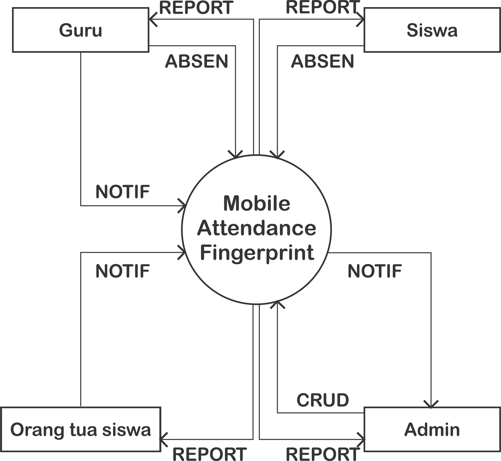

# Software Requirement Specification #

## Pendahuluan ##

1.1 Tujuan (bunda)

1.2 Lingkup (bunda)

1.3 Definisi, Akronim, Singkatan (bunda)

1.4 Referensi (bunda)

1.5 Overview (bunda)

## Gambaran Umum ##

2.1 Perspektif produk (opal)

2.1.1 Antarmuka sistem 

2.1.2 Antarmuka pengguna (kikis)

2.1.3 Antarmuka perangkat keras (kikis)

2.1.4 Antarmuka perangkat lunak (kikis)

2.1.5 Antarmuka komunikasi (opal)

2.1.6 Batasan-batasan memori (opal)

2.1.7 Operasi-operasi (opal)

2.1.8 Kebutuhan-kebutuhan dalam tahapan adaptasi (triyani)

2.2 Fungsi-fungsi produk (triyani)

2.3 Karakteristik pengguna (diyah)

2.4 Batasan-batasan (diyah)

2.5 Asumsi-asumsi dan ketrgantungan/keterkaitan (diyah)

2.6 Kebutuhan-kebutuhan penyeimbang (kikis)

Kebutuhan lain yang spesifik (triyani)

Informasi pendukung (diyah)