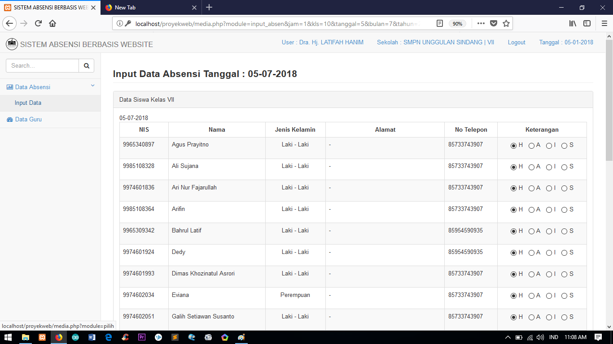
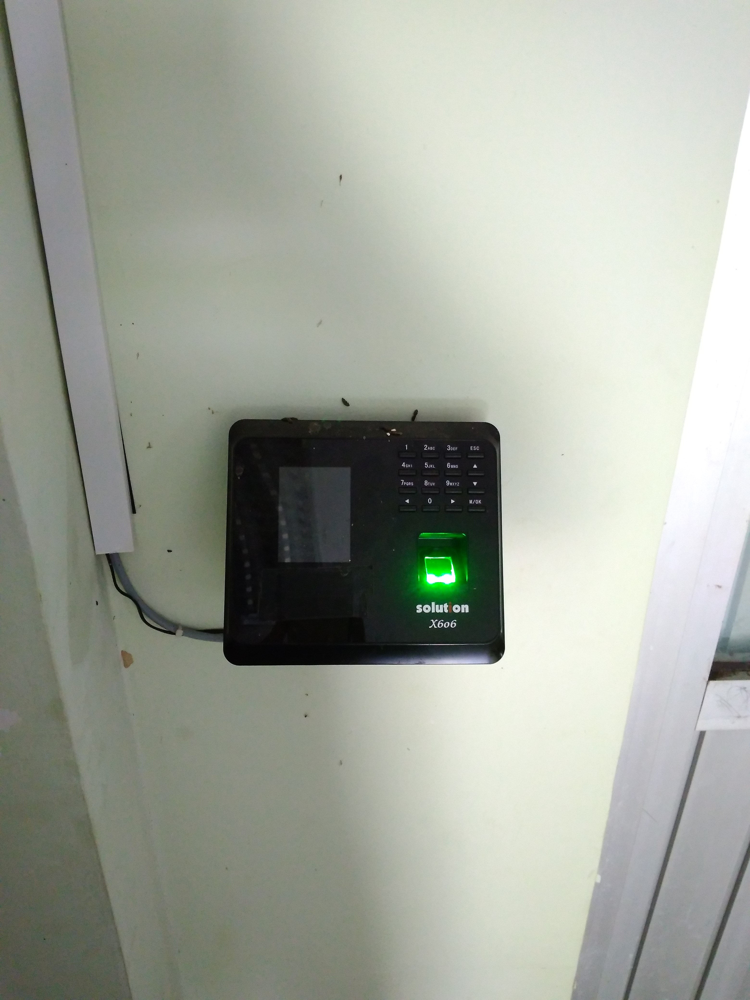
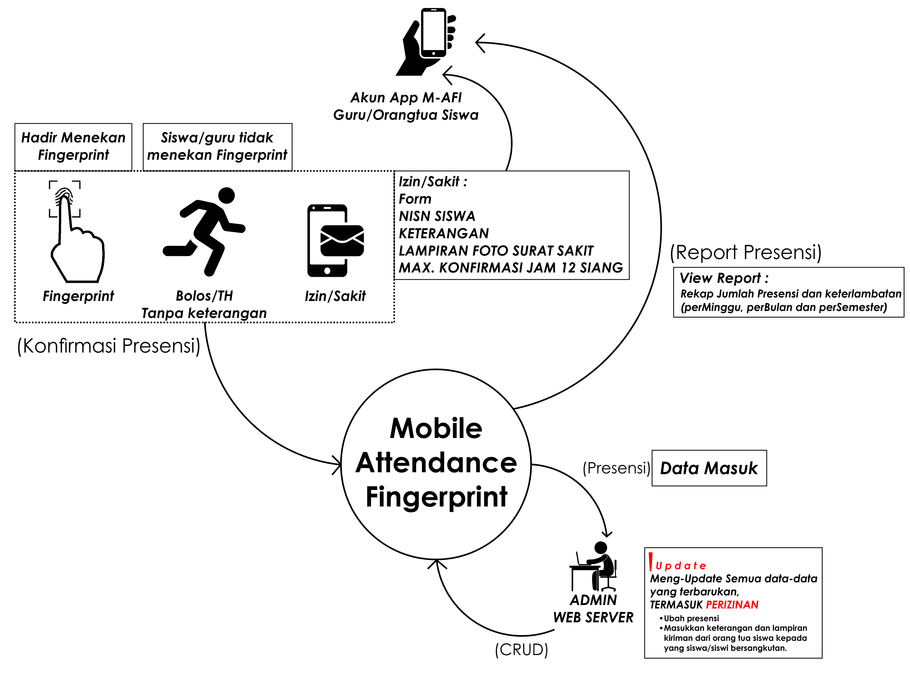
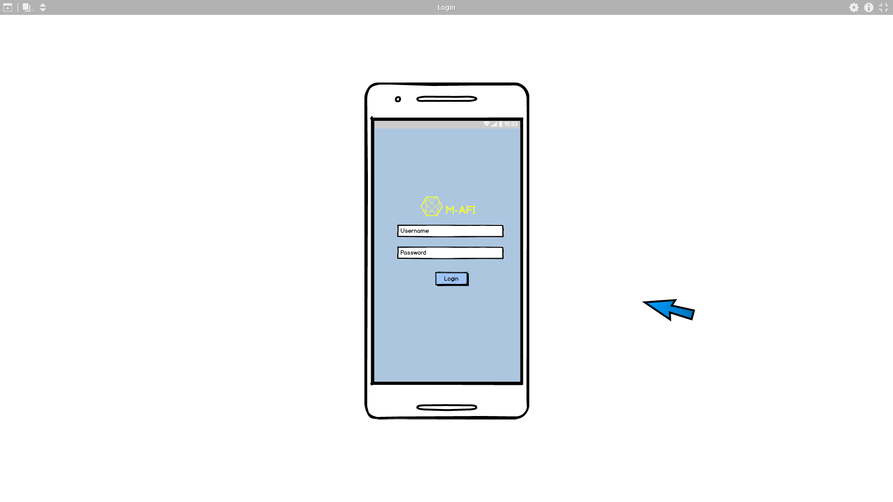
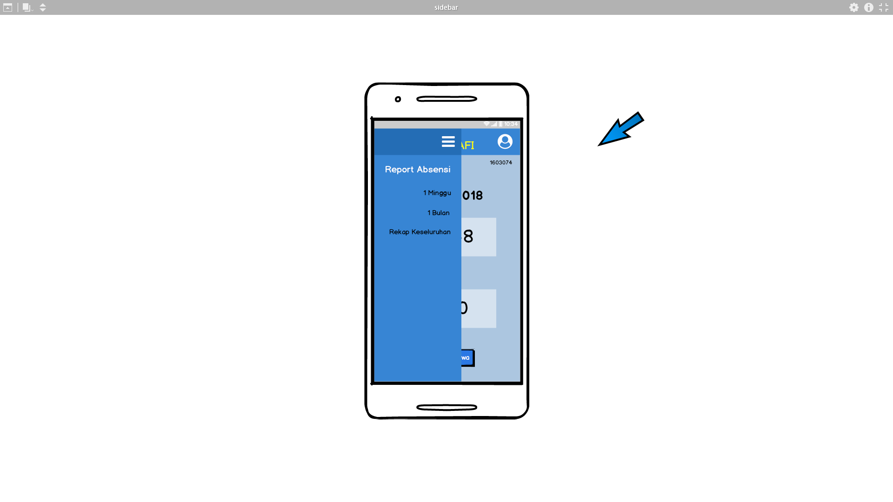
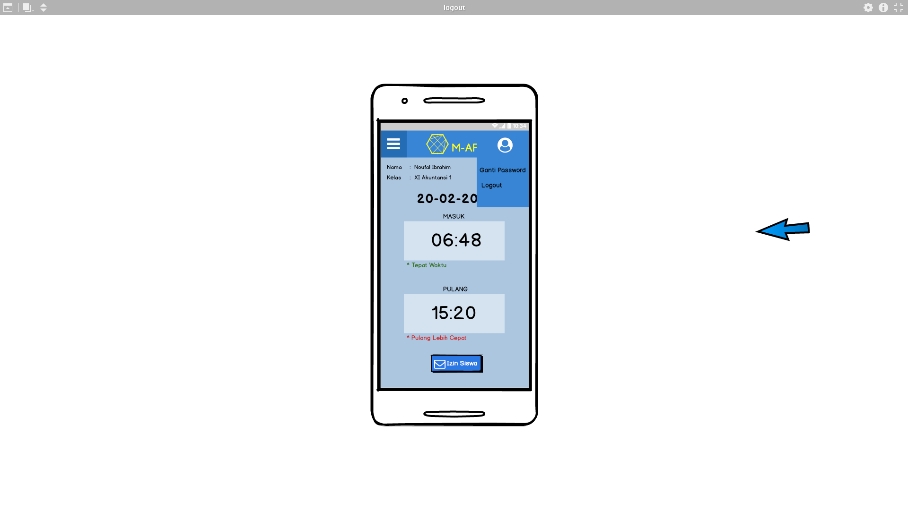
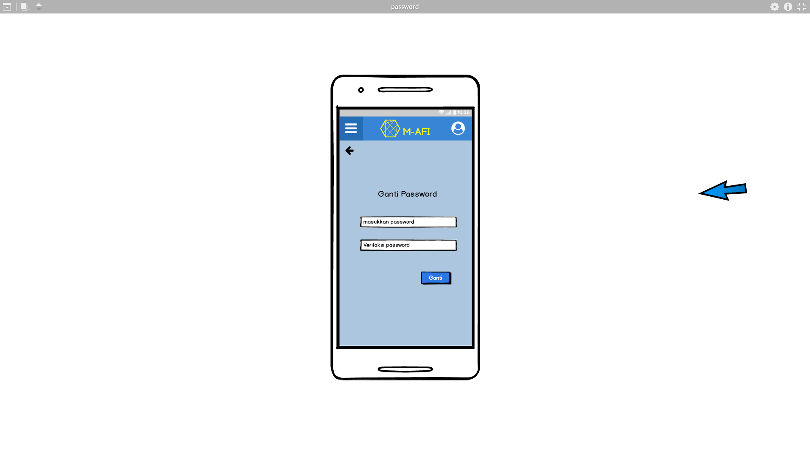
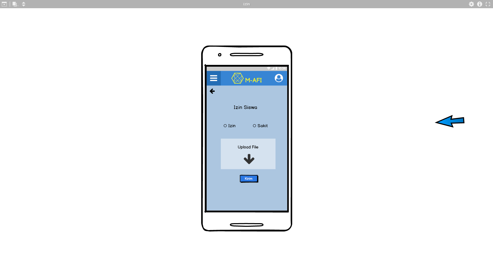

# Software Requirement Specification #

## Pendahuluan ##

1.1 Tujuan

Tujuan dari penulisan dokumen Softaware Requirement Specification (SRS) untuk mempermudah mengembangkan perangkat lunak untuk Mobile-Attendance Fingerprint
dan memberikan gambaran yang spesifik dari kebutuhan softaware Mobile-Attendance Fingerprint(M-AFI). Spesifikasi kebutuhan tersebut termasuk dari segi perangkat lunak dan perangkat keras,untuk memberikan gambaran dan 
penjelasan mengenai pembuatan produk termasuk kebutuhan fungsional hingga non-fungsional, dan kebutuhan antar muka mulai dari antar muka pengguna hingga antar muka komunikasi.

1.2 Lingkup

Ruang lingkup dalam membangun aplikasi M-AFI yaitu Mobile Attendence Fingerprint menggunakan beberapa perangkat lunak yang mendukung, diantaranya saat penginputan data siswa dan guru. M-AFI ini perlu dibuatkannya karena untuk mempermudah instansi pendidikan untuk sistem absensinya.

1.3 Definisi, Akronim, Singkatan

|   Singkatan  | Definisi |
| ------ | ------ |
| SRS | Merupakan singkatan dari Software Requirement Specfication |
| M-AFI | Singkatan Dari Mobile Attendence merupakan sebuah aplikasi absensi yang menggunakan mobile  |

1.4 Referensi

http://hanungnp.staff.telkomuniversity.ac.id/files/2015/04/contoh-SKPL-Sistem-informasi-tugas-akhir-SISTA.pdf

https://dillinger.io/

https://martinyunianto.wordpress.com/desain-dan-implementasi-sistem-informasi-absensi/

1.5 Overview

Pada dokumen ini memberikan penjelasan tentang gambaran umum, termasuk karakterisitik pengguna proyek ini, hardware produk, dan persyaratan fungsional seperti data siswa/guru pada instansi yag terkait yang digunakan untuk persyaratan penginputan data. Gambaran umum ini dibahasan pada bagian 2 yang terdiri dari prespektif produk,antarmuka sistem, antarmuka pengguna,antarmuka perangkat keras,antarmuka perangkat lunak sampe anatrmuka komunikasi. Hal ini juga dapat memberikan suatu kebutuhan yang terdapat pada aplikasi M-AFI (Mobile Attandence Finger Print).

## Gambaran Umum ##

2.1 Perspektif produk (opal)

A.	Perbandingan dengan produk-produk kompetitor

1.	Absensi siswa realtime dengan sms gateway

Aplikasi ini adalah aplikasi absensi yang memanfaatkan fitur sms gateway, aplikasi ini digunakan untuk memantau para siswa terkait dengan tingkat kedisiplinan dalam proses belajar di sekolah, dimana tingkat kedisiplinan kehadiran siswa menjadi salah satu tolok ukur dalam proses penilaian. 
Aplikasi ini memiliki kelebihan untuk orang tua siswa dalam memantau anaknya apabila anaknya tersebut tidak hadir di sekolah, sistem akan otomatis mengirim pemberitahuan melalui sms langsung ke HP orang tua siswa.

2.	Sistem absensi fingerprint untuk dosen di POLINDRA

Sistem absensi dosen yang diterapkan untuk para dosen di POLINDRA ini adalah sistem absensi yang diterapkan dengan menggunakan fingerprint, sistem ini mempunyai kelebihan cepat dan akurat dalam proses absensi, karena sistem ini menggunakan metode biometrik dalam pengaplikasiannya, metode biometrik dalam sistem ini adalah menggunakan sidik jari dosen.
Sistem ini belum bisa dilihat report presensinya untuk para dosen, jadi aplikasi ini hanya sekedar absensi menggunakan sidik jari, dan data absensi nya hanya masuk ke database, tetapi tidak bisa dilihat oleh para dosen.

3.	M-AFI (Mobile-Attendance Fingerprint)

M-AFI (Mobile-Attendance Fingerprint) adalah aplikasi project 2 yang sedang kita garap saat ini, aplikasi ini diterapkan untuk absensi siswa dan guru menggunakan fingerprint. Fingerprint adalah sebuah metode biometrik yang mana pengaplikasiannya menggunakan sidik jari.
Aplikasi ini memiliki 2 user, yaitu user admin dan user monitoring. User admin mempunyai hak akses untuk mengelola data absensi dan mengelola user monitoring melalui web server. User monitoring adalah user pengguna aplikasi yang memonitoring report presensi dengan menggunakan aplikasi mobile melalui smartphone, dimana user monitoring tersebut adalah guru dan orang tua siswa. User monitoring guru dapat melihat report presensi nya sendiri melalui smartphone, dan user monitoring orang tua  juga mereka dapat memonitoring report presensi anaknya (siswa) melalui smartphone.
Aplikasi ini juga bisa mengirimkan izin siswa melalui user monitoring orang tua siswa melalui smartphone, orang tua siswa bisa mengirimkan surat izin atau sakit dengan cara mengupload foto surat izin yang sebelumnya sudah dibuat tulis tangan oleh orang tua, dan selanjutnya surat itu difoto dan di upload melalui smartphone, yang nantinya dari sisi user admin akan menerima notifikasi dari web server dan selanjutnya akan di update keterangan presensi siswa tersebut oleh admin.

2.1.1 Antarmuka sistem 

2.1.2 Antarmuka pengguna

2.1.3 Antarmuka perangkat keras

- Fingerprint
- Server
- Laptop
- Smartphone

2.1.4 Antarmuka perangkat lunak (kikis)

- Webserver

	Untuk Webserver admin dapat di akses menggunakan semua jenis browser (google chrom, Mozila, Opera dan lain-lain), dan pastinya harus menggunakan akses internet untuk mengakses data pada Firebase.

- Mobile M-AFI

	Aplikasi M-AFI yang berfungsi sebagai monitoring absensi ini hanya dapat di akses melalui smartphone android dengan OS minimum Lolipop.

2.1.5 Antarmuka komunikasi (opal)

2.1.6 Batasan-batasan memori (opal)

2.1.7 Operasi-operasi (opal)

2.1.8 Kebutuhan-kebutuhan dalam tahapan adaptasi (triyani)

- untuk lokasi penempatan fingerprint dan komputer dipilih tempat yang strategis untuk pengimputan data supaya tidak terjadi antrian yang panjang.

2.2 Fungsi-fungsi produk (triyani)

- Modul absen adalah modul yang digunakan untuk melayani absensi siswa dan guru menggunakan teknologi fingerprint.
- Fungsi dari modul absensi adalah absensi siswa dan guru dilakukan secara digital
- Sistem absensi akan membaca data keterlambatan sesuai waktu yang ditentukan
- Hasil rekapitulasi absensi dapat dilihat secara cepat tepat dan akurat. 
- Hasil rekapitulasi dapat di kelompokkan berdasarkan waktu (hari, minggu, bulan, semester dan tahunan)
dan kelompok siswa( kelas, tahun ajaran, indeks prestasi dan lain-lain).
- Hasil rekapitulasi siswa juga dapat dilihat oleh orang tua siswa melalui perangkat bergerak atau smartphone.

2.3 Karakteristik pengguna (diyah)
karakteristik pengguna dari aplikasi M-AFI ini adalah semua yang ingin menggunakan absensi diantaranya siswa dan guru, 
dan orang tua yang membedakan adalah pengguna yang berinteraksi dengan sistem dihubungkan dengan hak akses dan 
autentifikasi sesuai aturan yang terdapat pada absensi.

2.4 Batasan-batasan (diyah)

 * Aplikasi M-AFI untuk waktu pengembangannya hanya ada beberapa fungsi yang dilaksanakan.
 * Pengembangan aplikasi M-AFI tidak akan mengubah file-file ataupun database yang ada
   pada saat ini tanpa adanya izin dari pihak sekolah.
 * Pengembangan aplikasi M-AFI ini akan meliputi pengelolaan data-data yang ada disekolah
   yang meliputi data absensi siswa dan guru serta laporan untuk siswa atau guru yang tidak 
   masuk.

2.5 Asumsi-asumsi dan ketrgantungan/keterkaitan (diyah)

* Semua absensi sekolah adalah siswa dan guru di sekolah. 
* Absensi disekolah sendiri akan dilakukan oleh siswa dan guru yang apabila ketika ingin kehadirannya masuk ke sekolah.

2.6 Kebutuhan-kebutuhan penyeimbang (kikis)

Kebutuhan lain yang spesifik (triyani)

Informasi pendukung (diyah)